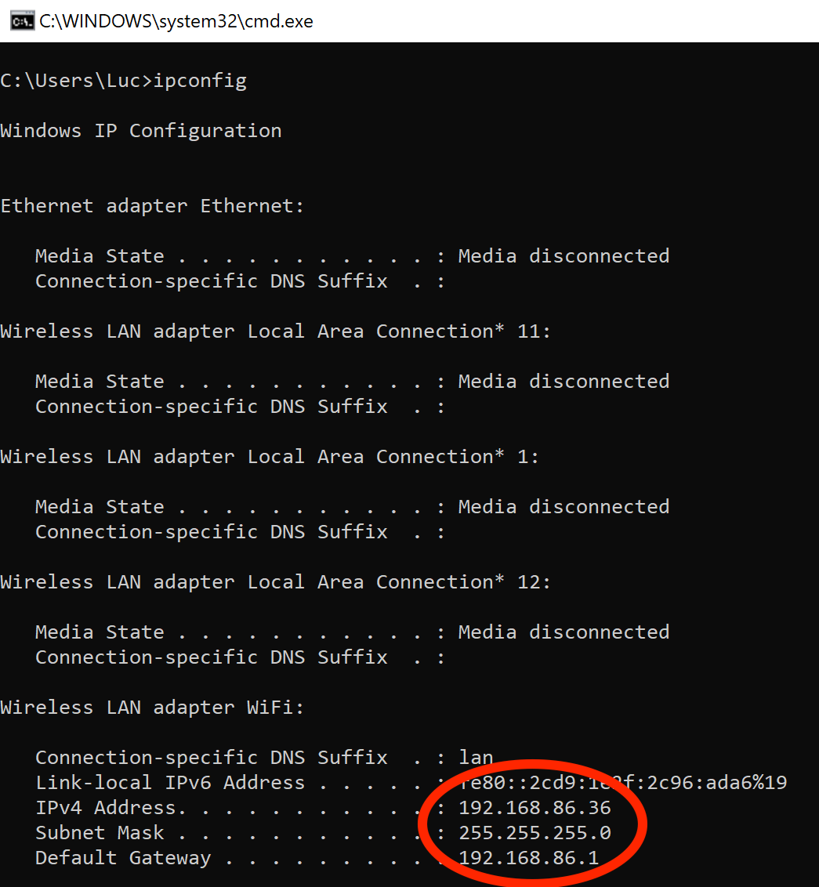

# iUFCExport-iPad
Display and interact with DCS (https://www.digitalcombatsimulator.com/) panels on your iPad

I'll push the Xcode project content into this repo as soon as Apple has approved my application on the App Store.

# Configuration
Normally, no configuration is needed. However, your local router may be too strict with local network broadcasts and you'll notice that your button pushes on the iPad will not reflect in DCS.
That's why there's a "Config" button in the top right of the home screen, where you select your plane.

*Note that depending on your iPad iOS version, some alternative IP addresses may work and other not. The last one should work in all cases.* 

Click on this "Config" button.
An alert will display with the  generic local network broadcast IP: `255.255.255.255`.

## Alternate config #1
Try changing it to the following other IP addresses: `224.0.0.1` This is the generic local network multicast.

If it works for you, fine, you won't need to change it again.

If it still doesn't work, you will have to find your local network subnet. To do so:
1) Open a Windows terminal: use `WINDOWS-R` key combination and enter `cmd.exe`
2) In your terminal, type `ipconfig`. Something like this will show up

In most cases, your subnet mask will be `255.255.255.0`, like in my example. If it's the case, try [alternate config #2](#alternate-config-2), else, unless you know what you're doing, I suggest you to directly go to [alternate config #3](#alternate-config-3).

## Alternate config #2
Your local broadbast IP address will be made of the 1st three numbers of your IPv4 Address to which you add the 4th number `255`. In my example, it would be: `192.168.86.255`.

If it works for you, fine, you won't need to change it again.

## Alternate config #3
Use your PC IPv4 Address. In my example, it would be: `192.168.86.36`

It should work now, but this is the last resort, because you will have to change this setting everytime your PC gets assigned a new IP address.

